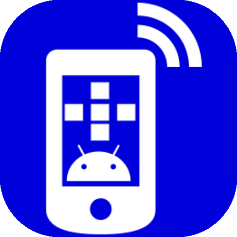
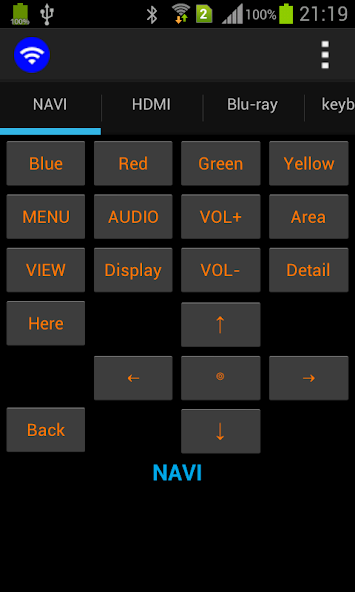
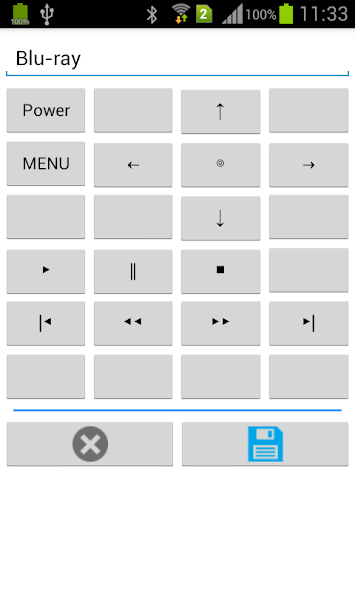
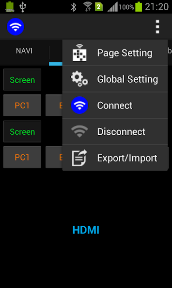
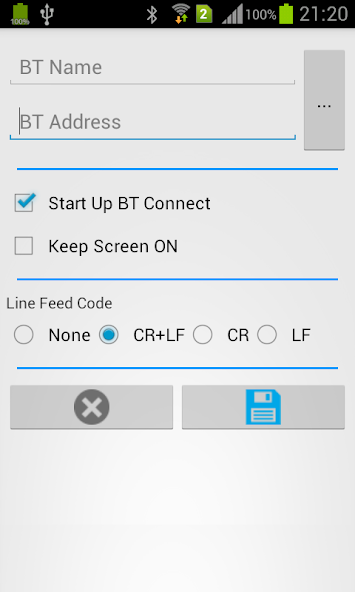
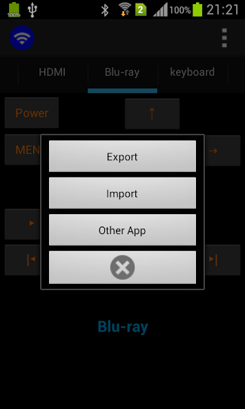
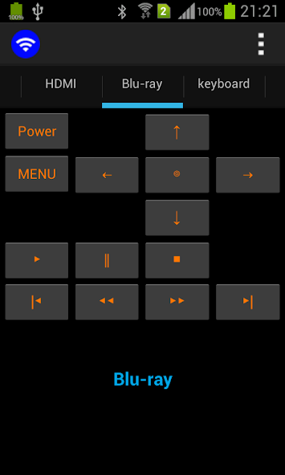
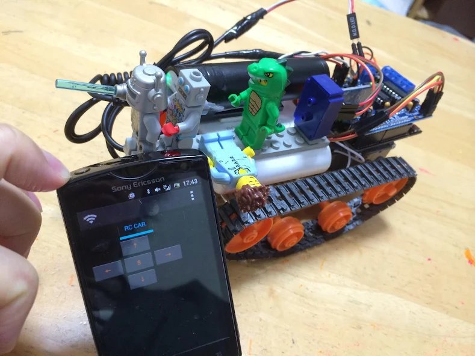
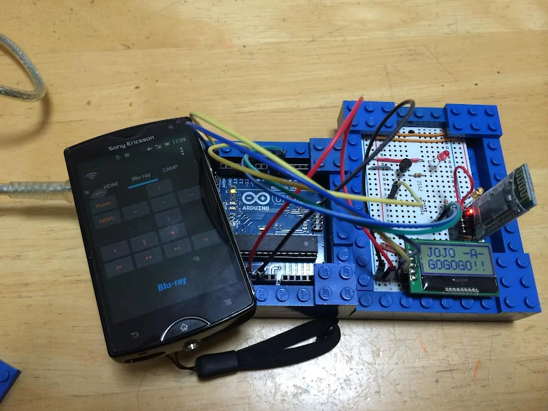

# BT Remote (SPP) for Bluetooth

<p>

</p>

BT remote control is an application that sends the characters in Bluetooth SPP (Serial Port Profile)

<p>
<a href="https://play.google.com/store/apps/details?id=com.jojoagogogo.btr">

</a>

<a href="https://github.com/jojoagogogo/btr/releases/latest/download/btremote.apk">

</a>

</p>

<p>








</p>

## BT Remote (SPP) for Bluetooth

```
BT remote control is an application that sends the characters in Bluetooth SPP (Serial Port Profile)

[ Usage ]
* Can send the character is set to pairing the equipment by Bluetooth SPP (Serial Port Profile)
* Button on the 4x10 are free to customize it is possible to assign Send Code
* Can add a line feed code to send characters
* Export / import Settings
```

## BT リモコン(SPP) for Bluetooth

```
BTリモコンはBluetooth SPP (Serial Port Profile) で文字を送信するアプリです

[できること]
* Bluetooth SPP (Serial Port Profile) ペアリングした機器に設定した文字を送信出来ます
* 4x10 のボタンを自由にカスタマイズしてボタンに送信する文字を割り当てることが出来ます
* 送信文字に改行コードを付加出来ます
* 設定内容のエクスポート/インポート
```
